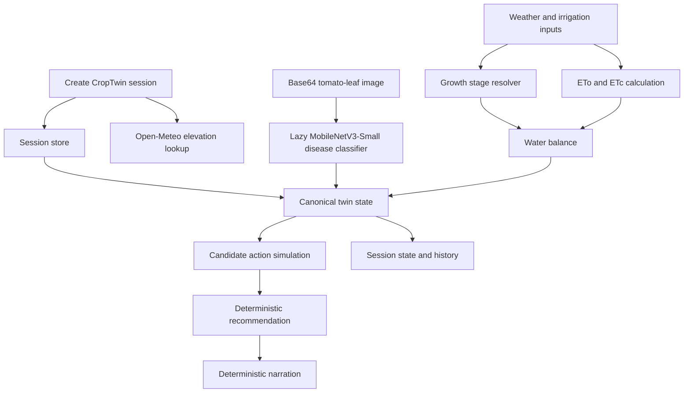

# CropTwin: Tomato Irrigation and Disease Digital Twin

CropTwin is a FastAPI-based tomato digital twin that combines crop stage, weather inputs, soil water balance, tomato-leaf disease evidence, irrigation-action simulations, deterministic recommendations, and safe farmer-readable narration.

It is a hackathon MVP for decision support. The system exposes reasoning behind irrigation guidance, but it is not a production agronomy system and does not replace field inspection or professional advice.

## Hackathon Context

CropTwin was built for the AMD Developer Hackathon Act II on lablab.ai. This repository contains the backend MVP: explicit agronomic assumptions, a session-scoped API workflow, a trained tomato-leaf classifier adapter, and automated tests for the main route sequence.

## Workflow

1. Create a session with crop, planting date, location, and soil texture.
2. Attach disease evidence from the MobileNetV3-Small tomato-leaf classifier.
3. Compute growth stage and water state from weather, crop coefficient, ETo, ETc, soil assumptions, rainfall, and optional irrigation event.
4. Assemble the canonical current twin state from cached disease, growth, and water outputs.
5. Simulate fixed candidate irrigation actions.
6. Build a deterministic irrigation recommendation.
7. Generate deterministic narration that explains the existing recommendation.

Ordering matters. The canonical twin state requires cached disease, growth, and water outputs. Simulation requires the current twin state. Recommendation requires cached simulation results. Narration requires a cached recommendation.

## Architecture



The deterministic agronomy engine owns irrigation decisions. The classifier supplies disease evidence only. It does not compute water balance, run simulations, choose irrigation, or provide pesticide, fungicide, insecticide, fertilizer, dosage, or treatment advice.

## API Endpoints

```text
GET  /health
GET  /system-info

POST /sessions
GET  /sessions/{state_id}
GET  /sessions/{state_id}/history

POST /sessions/{state_id}/predict-disease
POST /sessions/{state_id}/compute-water-state
POST /sessions/{state_id}/update-twin-state
POST /sessions/{state_id}/simulate-actions
POST /sessions/{state_id}/recommend
POST /sessions/{state_id}/narrate
```

## Disease Classifier

`POST /sessions/{state_id}/predict-disease` uses a trained MobileNetV3-Small tomato-leaf classifier through a lazy dependency-injected adapter.

- Model adapter: `app/disease/model.py`
- Canonical classes: `app/disease/classes.py`
- Confidence and uncertainty policy: `app/disease/uncertainty.py`
- Artifact directory: `model_artifacts/croptwin_disease/`
- Supported `model_version`: `"1.0"`
- Dataset: PlantVillage tomato subset, 10 classes
- Input: base64 or `data:image/...;base64,...`
- Preprocessing: resize shorter side to 256, center crop to 224 x 224, tensor conversion, artifact normalization
- Architecture: MobileNetV3-Small with ImageNet-pretrained initialization during training, classifier-head training followed by final-block fine-tuning
- Calibration: temperature scaling fitted on the validation split
- AMD validation context: training and inference validation recorded with ROCm PyTorch on AMD GPU runtime metadata in `test_metrics.json`

The adapter does not import torch or torchvision at FastAPI import time. Optional vision dependencies are listed separately in `requirements-vision.txt`; normal backend tests use dependency overrides and do not require torch, torchvision, a GPU, or model loading.

## Class Labels

The artifact class order is:

1. `Tomato___Bacterial_spot`
2. `Tomato___Early_blight`
3. `Tomato___Late_blight`
4. `Tomato___Leaf_Mold`
5. `Tomato___Septoria_leaf_spot`
6. `Tomato___Spider_mites Two-spotted_spider_mite`
7. `Tomato___Target_Spot`
8. `Tomato___Tomato_Yellow_Leaf_Curl_Virus`
9. `Tomato___Tomato_mosaic_virus`
10. `Tomato___healthy`

Spider mites are mapped to `DiseaseCategory.NONE` because the accepted API schema has fungal, bacterial, viral, and none categories, but no pest category.

## Verified Artifact Metrics

These values were read from the files in `model_artifacts/croptwin_disease/`:

| Metric | Value |
|---|---:|
| Temperature | `1.0508726748943829` |
| Confidence acceptance threshold | `0.7` |
| Validation ECE after calibration | `0.008117275312542915` |
| Test ECE after calibration | `0.008560522925108671` |
| Test accuracy | `0.953961012028204` |
| Test macro precision | `0.9514433459718663` |
| Test macro recall | `0.9468968994181605` |
| Test macro F1 | `0.9478684631559062` |

The test ECE was already very small before calibration and changed slightly after validation-fitted temperature scaling. CropTwin does not claim that laboratory-background PlantVillage accuracy equals real-farm performance.

## Uncertainty Policy

The classifier keeps the top-1 label even when confidence is low. Low-confidence predictions remain tentative disease evidence and should trigger manual-inspection behavior downstream.

- `confidence < 0.70`: high uncertainty
- `0.70 <= confidence < 0.90`: medium uncertainty
- `confidence >= 0.90`: low uncertainty
- `uncertainty_score = 1 - confidence`

The `0.70` acceptance threshold was selected from validation analysis. At this threshold, validation coverage was `0.9362`, accepted validation accuracy was `0.9724`, and validation error capture was `0.5231`.

## Local Installation

```powershell
git clone https://github.com/Eshuredd/AMD_DigitalTwin.git
cd AMD_DigitalTwin

python -m venv .venv
.\.venv\Scripts\Activate.ps1
python -m pip install --upgrade pip
python -m pip install -r requirements.txt
```

Install optional vision dependencies only for real classifier inference:

```powershell
python -m pip install -r requirements-vision.txt
```

Select a PyTorch and torchvision build compatible with the target AMD ROCm environment. This repository intentionally keeps the vision dependencies separate from the core API requirements.

## Running The API

```powershell
uvicorn app.main:app --reload
```

Useful local URLs:

- Swagger UI: `http://127.0.0.1:8000/docs`
- OpenAPI JSON: `http://127.0.0.1:8000/openapi.json`
- Health endpoint: `http://127.0.0.1:8000/health`

## Example Predict Disease Request

```json
{
  "state_id": "state_xxx",
  "image_base64": "/9j/4AAQSkZJRgABAQAAAQABAAD...",
  "model_version": "1.0"
}
```

The request also accepts a data URI prefix:

```json
{
  "state_id": "state_xxx",
  "image_base64": "data:image/jpeg;base64,/9j/4AAQSkZJRgABAQAAAQABAAD...",
  "model_version": "1.0"
}
```

When a request body contains `state_id`, it must match the path `state_id`.

## Repository Structure

```text
app/
  main.py                  FastAPI application wiring
  schemas.py               Pydantic request and response schemas
  dependencies.py          Shared dependencies, predictor singleton, and error handling
  state_store.py           In-memory session and output cache
  routes/                  API route modules
  external/                Elevation API client; weather client placeholder
  growth_stage/            Tomato growth-stage resolver
  water/                   ETo, crop coefficient, and water-balance modules
  disease/                 Class mapping, uncertainty policy, and lazy model adapter
  simulation/              Candidate irrigation-action simulator
  recommendation/          Deterministic recommendation engine
  narration/               Deterministic narration and optional client protocol

model_artifacts/
  croptwin_disease/        Trusted deployment bundle for the tomato classifier

tests/
  test_api_workflow.py     End-to-end API workflow and error-path tests
  test_disease_classes.py  Disease class mapping tests
  test_disease_model.py    Image decoding and artifact validation tests
  test_disease_uncertainty.py
  test_routes/             Focused route tests
```

## Running Tests

```powershell
python -m pytest -v
python -m pytest -v tests/test_routes/test_disease.py
```

The normal test suite uses FastAPI dependency overrides for the disease predictor. It does not require torch, torchvision, a GPU, ROCm, or loading the real `.pt` artifact. An optional smoke test skips when the vision runtime or real artifact execution is unavailable.

## Agronomic Assumptions

These values are MVP defaults, not field-calibrated agronomic recommendations.

| Assumption | Source value |
|---|---|
| Crop support | Tomato only |
| Growth-stage source | `fao56_table11_tomato_apr_may_mediterranean_stage_lengths` |
| Tomato stage durations | initial 30, development 40, mid-season 45, late-season 30 days |
| Kc source | `mvp_fao56_style_tomato_assumed_kc_by_growth_stage` |
| Kc by stage | initial 0.60, development 0.80, mid-season 1.15, late-season 0.80 |
| Soil parameter basis | `mvp_assumed_volumetric_field_capacity_wilting_point_by_soil_texture` |
| Root-depth basis | `mvp_assumed_tomato_root_depth_by_growth_stage` |
| Allowable depletion fraction | 0.50 |
| Fungal recommendation confidence threshold | 0.80 |
| Narration length safety limit | 1200 characters |

## Safety And Limitations

- The deterministic water model owns crop-water calculations.
- The deterministic recommendation engine owns the irrigation action.
- Disease evidence can add caution, uncertainty, constraints, and inspection advice.
- Disease evidence does not directly choose the irrigation action.
- Narration cannot recompute water balance, rerun simulation, or change the recommendation.
- High-uncertainty disease evidence should be inspected before relying on disease-specific constraints.
- PlantVillage imagery has lab-background limitations and is not equivalent to field validation.
- CropTwin does not provide treatment, chemical, dosage, or pesticide advice.
- In-memory state is lost when the process restarts.
- Tomato is the only supported crop.
- Weather values are supplied in API requests; live weather ingestion is not implemented.
- Elevation lookup depends on Open-Meteo unless elevation is supplied in the session request.
- No authentication, persistent database, production monitoring, or field validation is implemented.
