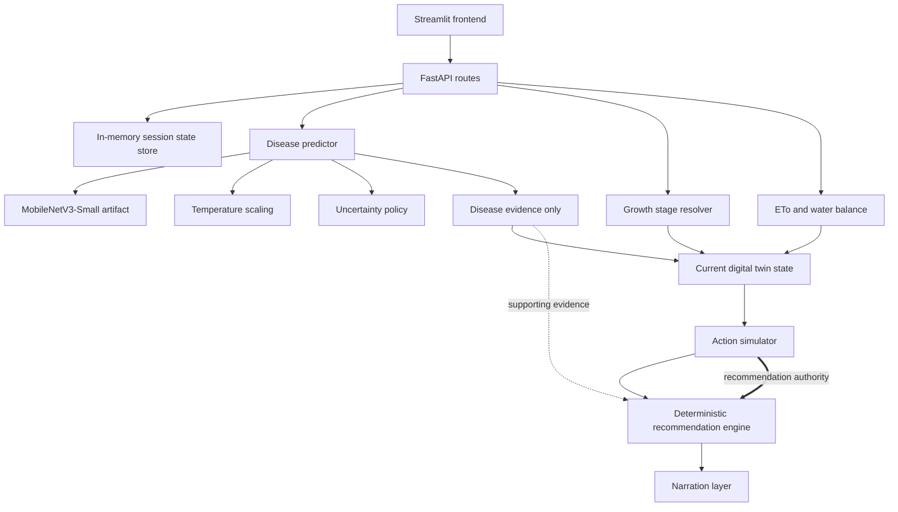

# CropTwin

**Tomato Irrigation and Disease Digital Twin**

Deterministic agronomy with AI-assisted disease evidence.

CropTwin is a FastAPI-based tomato-crop digital twin for local or internal MVP demonstration. It combines deterministic crop-water reasoning with a locally stored MobileNetV3-Small tomato-leaf classifier. The classifier contributes disease evidence; the deterministic agronomy engine remains the authority for irrigation recommendations.

CropTwin does not treat model output as a confirmed diagnosis, and it does not replace field inspection or professional agronomic advice.

| Component | Status |
|---|---|
| FastAPI backend | Implemented |
| Deterministic water balance | Implemented |
| Tomato disease classifier | Implemented |
| Temperature calibration | Implemented |
| Streamlit frontend | Implemented |
| Automated tests | Implemented |
| Persistent database | Not yet implemented |
| Public deployment | Not yet implemented |

## Key Capabilities

- Tomato session creation with location, planting date, and soil texture.
- Open-Meteo elevation lookup when session elevation is omitted.
- Open-Meteo daily weather retrieval for the active farm location, with manual overrides.
- Tomato growth-stage determination from planting date.
- ETo calculation with Penman-Monteith and Hargreaves-Samani fallback.
- ETc, root-zone depletion, moisture-state, and stress-band estimation.
- Farmer-friendly irrigation input using depth, litres over area, or drip runtime details.
- Tomato-leaf image classification with calibrated confidence and uncertainty bands.
- Current digital-twin state creation from cached disease, growth, and water outputs.
- Candidate irrigation-action simulation.
- Deterministic irrigation recommendation with disease-related caution and inspection advisory.
- Farmer-readable narration of an already-selected recommendation.
- Session history.
- Streamlit workflow interface.
- Direct FastAPI, Swagger, and ReDoc access.

## Problem Statement

Irrigation decisions often depend on disconnected data: crop stage, weather, soil assumptions, recent irrigation, and visible plant symptoms. Disease symptoms can matter for irrigation caution, especially leaf-wetness risk, but a probabilistic image classifier should not directly control irrigation.

CropTwin separates those responsibilities. Physical and agronomic calculations are deterministic. Disease inference supplies supporting evidence and uncertainty. The recommendation engine chooses irrigation actions from water-state and simulation outputs, with disease evidence used only for caution, constraints, and inspection advice.

## Architecture



The disease model does not compute water balance, run simulations, or choose the irrigation action. The narrator explains a cached recommendation; it does not recompute water balance, rerun simulation, or override the deterministic recommendation.

## End-to-End Workflow

1. Create or load a tomato session.
2. Upload a tomato-leaf image.
3. Receive disease evidence, calibrated confidence, and uncertainty.
4. Fetch weather for the farm or review weather values manually.
5. Enter recent irrigation as millimetres, total litres over area, or drip runtime details.
6. Compute ETo, ETc, water state, and stress.
7. Update the current digital-twin state.
8. Simulate candidate irrigation actions.
9. Generate the deterministic recommendation.
10. Generate farmer-readable narration.
11. Review current state and history.

Supported simulation actions:

| Action enum | Meaning |
|---|---|
| `IRRIGATE_NOW` | Irrigate immediately |
| `IRRIGATE_IN_6H` | Irrigate in 6 hours |
| `IRRIGATE_TOMORROW_AM` | Irrigate in 24 hours; current MVP approximation for tomorrow morning |
| `NO_IRRIGATION_24H` | Do not irrigate during the next 24 hours |

## Technology Stack

| Layer | Technology |
|---|---|
| Backend API | FastAPI |
| Validation and schemas | Pydantic |
| Disease model runtime | PyTorch / Torchvision |
| Model architecture | MobileNetV3-Small |
| Image handling | Pillow |
| Frontend | Streamlit |
| HTTP client | httpx |
| Testing | pytest |
| State storage | In-memory state store |
| Recorded training/runtime context | AMD ROCm PyTorch environment |

The disease model is a locally stored Torchvision/PyTorch artifact. CropTwin does not use Hugging Face and does not download model weights at runtime.

## Disease Model

`POST /sessions/{state_id}/predict-disease` runs a trained tomato-leaf classifier through a lazy dependency-injected predictor.

| Property | Value |
|---|---|
| Architecture | MobileNetV3-Small |
| Runtime model reconstruction | `torchvision.models.mobilenet_v3_small(weights=None)` |
| Trained weights | Loaded from local artifact |
| Dataset | PlantVillage tomato subset |
| Classes | 10 |
| Input size | 224 x 224 |
| Supported API `model_version` | `1.0` |
| Calibration | Temperature scaling fitted on validation split |
| Runtime artifact directory | `model_artifacts/croptwin_disease/` |

Training used ImageNet-pretrained Torchvision initialization, classifier-head training, and final feature-block fine-tuning. Runtime inference reconstructs the architecture with `weights=None`, then loads trained weights from the committed artifact.

The model adapter validates the artifact before inference:

- required-file presence
- manifest checksums
- class-order compatibility
- uncertainty policy compatibility
- temperature metadata compatibility
- safe `weights_only=True` loading
- scoped `TorchVersion` allowlist compatibility for artifact metadata

Important artifact files:

```text
model_artifacts/croptwin_disease/
  croptwin_tomato_mobilenet_v3_small.pt
  manifest.json
  class_to_idx.json
  temperature.json
  uncertainty_policy.json
  test_metrics.json
  per_class_metrics.csv
  confusion_matrix.csv
```

The classifier output is disease evidence, not a confirmed diagnosis.

## Model Evaluation

The following values were read from the current artifact files in `model_artifacts/croptwin_disease/`.

| Metric | Value |
|---|---:|
| Test sample count | `2411` |
| Test accuracy | `0.953961012028204` |
| Test macro precision | `0.9514433459718663` |
| Test macro recall | `0.9468968994181605` |
| Test macro F1 | `0.9478684631559062` |
| Calibration temperature | `1.0508726748943829` |
| Validation ECE before calibration | `0.01117339072516188` |
| Validation ECE after calibration | `0.008117275312542915` |
| Test ECE before calibration | `0.006922619584656786` |
| Test ECE after calibration | `0.008560522925108671` |
| Confidence acceptance threshold | `0.7` |
| Validation images for threshold selection | `2397` |
| Validation coverage at threshold | `0.9362` |
| Accepted validation accuracy | `0.9724` |
| Validation error capture rate | `0.5231` |

Temperature scaling was selected on validation data. The classifier was evaluated on an untouched test split. The test ECE was already small before calibration and was slightly larger after applying the validation-fitted temperature, so this README does not claim calibration improved test ECE.

Lowest per-class F1 values in the current artifact:

| Class | Support | Precision | Recall | F1 |
|---|---:|---:|---:|---:|
| `Tomato___Target_Spot` | `212` | `0.8156862745098039` | `0.9811320754716981` | `0.8907922912205568` |
| `Tomato___Early_blight` | `150` | `0.9219858156028369` | `0.8666666666666667` | `0.8934707903780069` |
| `Tomato___Spider_mites Two-spotted_spider_mite` | `252` | `0.9734513274336283` | `0.873015873015873` | `0.9205020920502092` |

PlantVillage imagery uses controlled backgrounds and does not establish real-field generalization.

## Uncertainty Policy

The confidence policy is implemented in `app/disease/uncertainty.py` and mirrored in `uncertainty_policy.json`.

| Calibrated confidence | Uncertainty band |
|---|---|
| `< 0.70` | `high` |
| `>= 0.70` and `< 0.90` | `medium` |
| `>= 0.90` | `low` |

`uncertainty_score = 1 - confidence`.

Low confidence does not replace the top-1 label with `uncertain`. The top-1 label remains visible as tentative evidence. High uncertainty should trigger clearer image capture and manual inspection. Confidence is not a guarantee of correctness, and some incorrect predictions may still have high confidence.

## Deterministic Agronomy Engine

CropTwin uses deterministic modules for crop stage, ETo, water balance, simulation, and recommendation. The same inputs produce the same domain result.

Implemented assumptions and calculations include:

- Tomato-only crop support.
- FAO-56 Table 11-style tomato stage durations: initial 30, development 40, mid-season 45, late-season 30 days.
- Stage Kc values: initial `0.60`, development `0.80`, mid-season `1.15`, late-season `0.80`.
- Penman-Monteith ETo when shortwave radiation is available.
- Hargreaves-Samani ETo fallback when shortwave radiation is missing.
- ETc from ETo and Kc.
- Soil texture assumptions for field capacity and wilting point.
- Root depth assumptions by growth stage.
- Total available water (TAW).
- Readily available water threshold using `p_allowable = 0.50`.
- Root-zone depletion update from ETc, rainfall, and a non-duplicated irrigation event.
- Moisture-state and stress-band classification.
- 24-hour candidate action simulation.
- Deterministic recommendation selection from current state and cached simulation.

Disease evidence can add caution reasons, inspection advisory, or irrigation constraints such as avoiding overhead irrigation for stronger fungal wetness risk. It does not override the water engine.

## Weather and Irrigation Inputs

`GET /sessions/{state_id}/weather-snapshot?target_date=YYYY-MM-DD` retrieves one day of model-derived weather from Open-Meteo using the stored session latitude and longitude. The weather snapshot includes:

- minimum and maximum 2 m air temperature
- mean relative humidity
- precipitation sum
- shortwave radiation sum
- mean 10 m wind speed, normalized to 2 m for Penman-Monteith input
- Open-Meteo FAO ETo

CropTwin still computes ETo locally. The Open-Meteo ETo value is stored only as `WeatherInput.eto_reference_feed` for comparison, not as the final CropTwin ETo. Weather values can be manually overridden before water-state computation.

Recent irrigation can be entered as millimetres, total litres plus irrigated area, or drip runtime plus emitter details. The backend still receives the canonical `LastIrrigationEvent.amount_mm`. The conversion basis is that 1 litre over 1 m2 equals 1 mm.

## Streamlit Frontend

The Streamlit frontend lives in `frontend/`. It is an HTTP client for the FastAPI API and does not import backend model or agronomy modules directly.

The frontend supports:

- backend connection status
- collapsed technical settings
- session creation and loading
- read-only active-session display
- tomato-leaf upload
- disease evidence, confidence, uncertainty, and top probabilities
- Open-Meteo weather fetch with manual weather overrides
- farmer-friendly irrigation conversion from litres/area or drip runtime details
- water-state and twin-state summaries
- action simulation comparison
- deterministic recommendation display
- narration
- current state and history refresh
- raw API responses in collapsed expanders

The frontend uses `CROPTWIN_API_BASE_URL` or the Settings panel to choose the API target. The default target is `http://127.0.0.1:8000`.

No screenshot files are currently stored in the repository.

## API Endpoints

| Method | Endpoint | Purpose |
|---|---|---|
| `GET` | `/health` | Process health |
| `GET` | `/system-info` | Model and agronomy metadata |
| `POST` | `/sessions` | Create a session |
| `GET` | `/sessions/{state_id}` | Read current session state |
| `GET` | `/sessions/{state_id}/history` | Read twin history |
| `GET` | `/sessions/{state_id}/weather-snapshot` | Fetch one-day Open-Meteo weather for the stored farm location |
| `POST` | `/sessions/{state_id}/predict-disease` | Run disease inference |
| `POST` | `/sessions/{state_id}/compute-water-state` | Compute growth and water state |
| `POST` | `/sessions/{state_id}/update-twin-state` | Build current twin state |
| `POST` | `/sessions/{state_id}/simulate-actions` | Simulate candidate actions |
| `POST` | `/sessions/{state_id}/recommend` | Generate recommendation |
| `POST` | `/sessions/{state_id}/narrate` | Explain recommendation |

Local API documentation:

- Swagger UI: `http://127.0.0.1:8000/docs`
- ReDoc: `http://127.0.0.1:8000/redoc`
- OpenAPI JSON: `http://127.0.0.1:8000/openapi.json`

## Repository Structure

```text
AMD_DigitalTwin/
  backend/
    app/
      disease/
      external/
      growth_stage/
      narration/
      recommendation/
      routes/
      simulation/
      water/
      dependencies.py
      main.py
      schemas.py
      state_store.py
    tests/
  frontend/
    app.py
    api_client.py
    ui_helpers.py
    requirements.txt
    README.md
  docker/
  .streamlit/
  Dockerfile
  pyproject.toml
  README.md
```

There is no `requirements-vision.txt` in the current checkout; the vision runtime packages are listed in `requirements.txt`.

## Installation

The project has been locally tested with Python 3.12. The repository does not currently declare a formal Python version range in `pyproject.toml`.

Clone and create an environment:

```powershell
git clone https://github.com/Eshuredd/AMD_DigitalTwin.git
cd AMD_DigitalTwin

python -m venv .venv
.\.venv\Scripts\Activate.ps1
python -m pip install --upgrade pip
```

Install backend, model runtime, and test dependencies:

```powershell
python -m pip install -r requirements.txt
```

Install frontend dependencies:

```powershell
python -m pip install -r frontend/requirements.txt
```

`requirements.txt` includes `torch` and `torchvision`. Select builds compatible with the target CPU, GPU, or AMD ROCm runtime. The repository does not require a Hugging Face install step.

## Running the Application

Use two terminals during local development.

Terminal 1: start FastAPI.

```powershell
.\.venv\Scripts\Activate.ps1
uvicorn app.main:app --reload
```

Terminal 2: start Streamlit.

```powershell
.\.venv\Scripts\Activate.ps1
streamlit run frontend/app.py
```

Default local URLs:

- API: `http://127.0.0.1:8000`
- Swagger UI: `http://127.0.0.1:8000/docs`
- ReDoc: `http://127.0.0.1:8000/redoc`
- Streamlit: usually `http://localhost:8501`

`--reload` is for local development, not production serving.

## Using the API Directly

The disease endpoint expects the path `state_id` to match the body `state_id`.

```json
{
  "state_id": "state_xxx",
  "image_base64": "/9j/4AAQSkZJRgABAQAAAQABAAD...",
  "model_version": "1.0"
}
```

Data URI prefixes are accepted:

```json
{
  "state_id": "state_xxx",
  "image_base64": "data:image/jpeg;base64,/9j/4AAQSkZJRgABAQAAAQABAAD...",
  "model_version": "1.0"
}
```

For full request and response schemas, use Swagger or ReDoc.

## Configuration

| Variable | Default | Used by | Purpose |
|---|---|---|---|
| `CROPTWIN_DISEASE_ARTIFACT_DIR` | `model_artifacts/croptwin_disease` | Backend | Overrides the disease artifact directory for inference and `/system-info`. |
| `CROPTWIN_API_BASE_URL` | `http://127.0.0.1:8000` | Frontend | Sets the FastAPI target for the Streamlit HTTP client. |

`.env.example` currently documents `CROPTWIN_API_BASE_URL`.

## Testing

Run the complete test suite:

```powershell
python -m pytest -v
```

Focused commands:

```powershell
python -m pytest -v tests/test_disease_model.py
python -m pytest -v tests/test_routes/test_disease.py
python -m pytest -v tests/test_frontend_api_client.py
python -m pytest -v tests/test_frontend_ui_helpers.py
```

Current local verification:

| Command | Result |
|---|---|
| `python -m pytest -v` | `130 passed in 4.42s` |
| `python -m pytest -v tests/test_frontend_api_client.py` | `10 passed in 0.11s` |
| `python -m pytest -v tests/test_frontend_ui_helpers.py` | `11 passed in 0.04s` |

The full suite includes API workflow tests, route tests, disease artifact validation, image validation, uncertainty policy tests, ETo tests, and frontend HTTP/helper tests. Some route tests use dependency overrides; the optional real artifact smoke test runs when the local runtime can execute it.

## Current Limitations

- State is stored in memory and is lost when the backend process restarts.
- No persistent database is implemented.
- No authentication or multi-user isolation is implemented.
- Open-Meteo weather retrieval is available with manual overrides; the data is model-derived and is not equivalent to an on-farm weather station.
- No on-farm weather-station or soil-moisture-sensor integration is implemented.
- Real irrigation amounts still require farmer, controller, or sensor information.
- PlantVillage images have controlled backgrounds and do not prove real-field performance.
- Unrelated or out-of-distribution images may still produce predictions.
- Confidence thresholds were selected from the current validation split.
- No public production deployment is included.
- No field validation is included.
- No treatment recommendation engine is included.
- Local development servers are not production hosting.

## Future Improvements

- SQLite or PostgreSQL persistence.
- Authentication and user/session separation.
- On-farm weather-station and soil-moisture-sensor integration.
- Real-field tomato-leaf dataset evaluation.
- Out-of-distribution and non-tomato image rejection.
- Model monitoring and recalibration workflow.
- Deployment packaging.
- Dockerization.
- Structured logs and observability.
- CI.
- Production serving.
- Mobile-friendly UI improvements.

## Safety and Scope

CropTwin is an MVP decision-support system.

- Disease output is supporting evidence, not a confirmed diagnosis.
- Irrigation decisions come from deterministic agronomy logic.
- High-uncertainty disease results require manual inspection.
- The project does not provide pesticide, fertilizer, fungicide, insecticide, chemical, or dosage advice.
- The project does not replace professional agronomic advice or field inspection.
